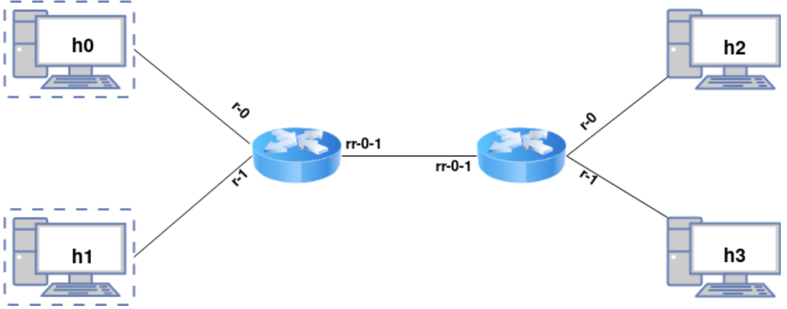

# Router dataplane

In acest proiect, am realizat functionalitatea dataplane a unui router. <br>
Se foloseste mininet pentru a simula urmatoare topologie:



Functionalitati & protocoale incluse:
  * Protocolul ARP
    * Caching, adresele din pachetele ARP vor fi retinute de catre router pentru a reduce numarul de ARP requests/replies
  * Protocolul ICMP
    * Mesaj `Destination unreachable`
    * Mesaj `Time exceeded`
  * IPv4 packet forwarding
    * Verificare pachete proprii
    * Verificare checksum
    * Verificare si actualizare TTL
    * Cautare in tabela de rutare
      * Optimizat, folosind binary search
      * Sunt tabele statice, reprezentate de doua fisiere `rtable0.txt` si `rtable1.txt`, pentru routerul 0, si respectiv, routerul 1.
    * Actualizare checksum
    * Rescriere adrese Ethernet
    * Trimiterea pachetului pe interfata corespunzatoare
  * Longest prefix match

## Dependinte

```bash
sudo apt install mininet openvswitch-testcontroller xterm python3-pip
sudo cp /usr/bin/ovs-testcontroller /usr/bin/ovs-controller
sudo pip3 install scapy
sudo pip3 install pathlib
sudo pip3 install git+https://github.com/mininet/mininet.git
```

## Testare

Pornire routere

```bash
./router rtable0.txt rr-0-1 r-0 r-1
./router rtable1.txt rr-0-1 r-0 r-1
```

Rulare teste
```bash
sudo python3 topo.py tests
```

## Credits

Scheletul de cod si suita de teste apartin echipei de *Protocoale de Comunicatii* 2022 din *Facultatea de Automatica si Calculatoare* din *Universitatea Politehnica din Bucuresti*.

Aprilie 2022
